<div align="right">

[繁體中文](README.md) | **English**

</div>

<div align="center">

# Wu Jue Tea

**Premium Alishan High-Mountain Tea from Chiayi, Taiwan | D2C E-Commerce + Tea Experience Booking Platform**

[](https://nextjs.org/)
[](https://www.typescriptlang.org/)
[](https://tailwindcss.com/)
[](https://supabase.com/)
[](https://stripe.com/)
[](https://www.paypal.com/)
[](https://vitest.dev/)
[](LICENSE)

[Live Demo](https://taiwantea.store) · [Admin Panel](https://taiwantea.store/admin)

</div>

---

## Highlights

- **Production app serving real customers** — not a tutorial clone or demo project
- **End-to-end e-commerce**: product catalog → cart → multi-gateway checkout → order tracking → email notifications
- **Complete booking system**: session calendar → waitlist with auto-cascade → post-experience reviews
- **International order support**: Stripe / PayPal international payments + global shipping rate calculation
- **AI customer service**: Groq LLM-powered real-time chatbot for product & order inquiries
- **Admin dashboard**: revenue charts, order/booking/product management, review moderation
- **Security-first**: 2FA (TOTP), CSP nonce, RLS, HMAC-signed sessions, rate limiting, server-side price validation
- **Bilingual (zh-TW / EN)** with next-intl, including all transactional emails
- **SEO optimized**: JSON-LD structured data, dynamic sitemap, robots.txt, auto-generated OG images
- **Automation**: Vercel Cron jobs for booking completion, reminders, and waitlist expiry
- **Automated testing**: Vitest unit tests covering international shipping & PayPal payment flows

---

## Screenshots

### Storefront — E-Commerce
<table>
  <tr>
    <td align="center"><strong>Home</strong></td>
    <td align="center"><strong>Products</strong></td>
  </tr>
  <tr>
    <td></td>
    <td>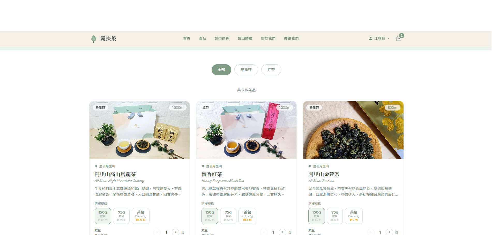</td>
  </tr>
  <tr>
    <td align="center"><strong>Cart</strong></td>
    <td align="center"><strong>Checkout</strong></td>
  </tr>
  <tr>
    <td>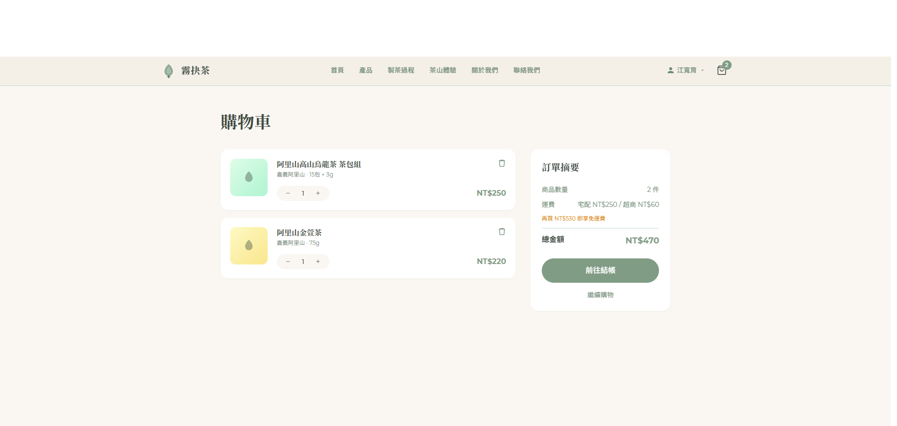</td>
    <td>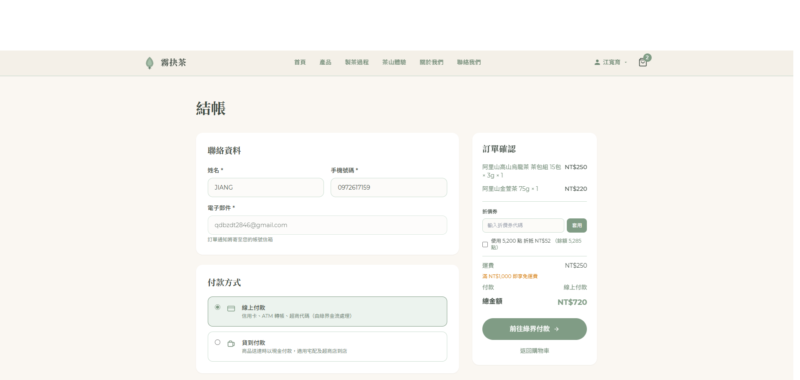</td>
  </tr>
</table>

### Storefront — Tea Experiences
<table>
  <tr>
    <td align="center"><strong>Experience List</strong></td>
    <td align="center"><strong>Experience Detail</strong></td>
    <td align="center"><strong>Reviews</strong></td>
  </tr>
  <tr>
    <td>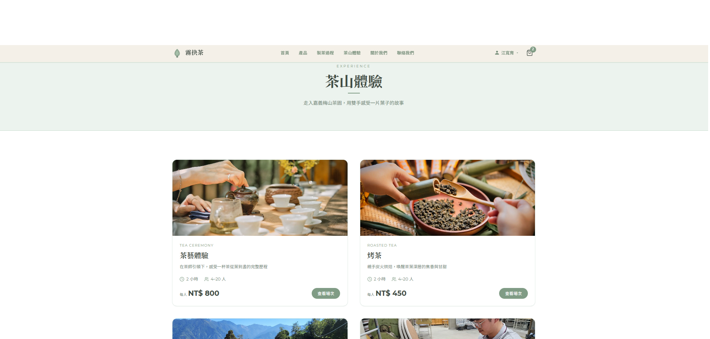</td>
    <td>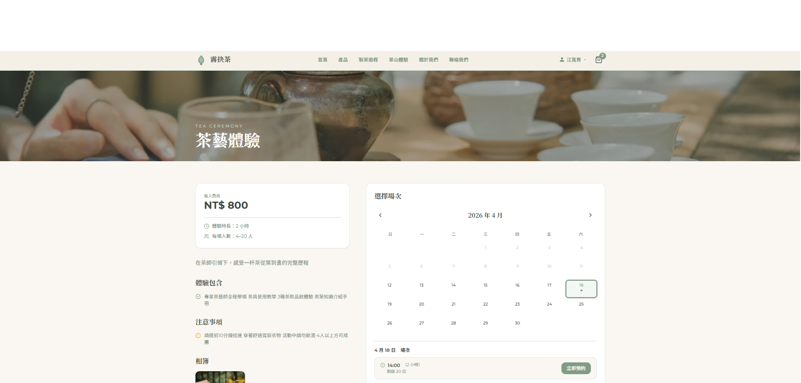</td>
    <td>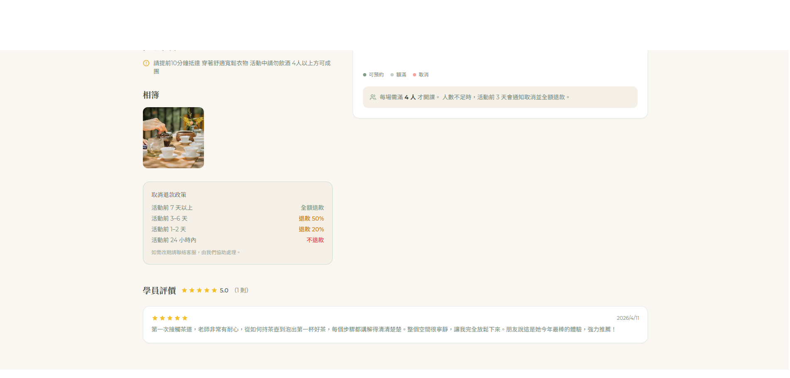</td>
  </tr>
  <tr>
    <td align="center"><strong>Booking — Select Session</strong></td>
    <td align="center"><strong>Booking — Fill Details</strong></td>
    <td align="center"><strong>Booking — Payment</strong></td>
  </tr>
  <tr>
    <td>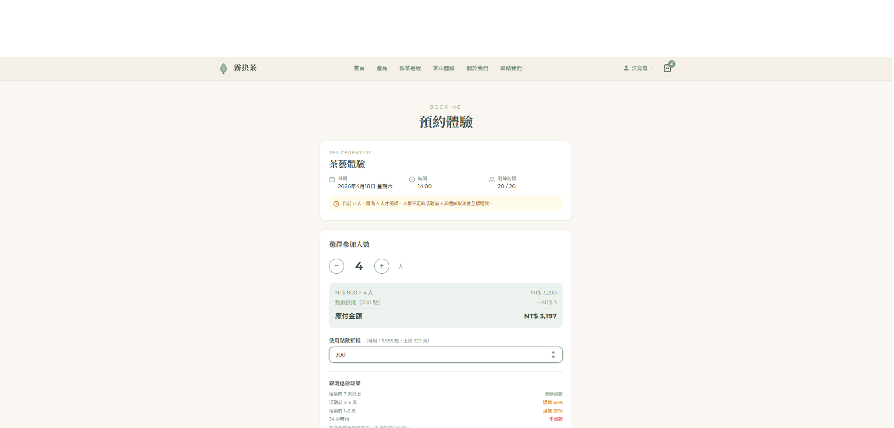</td>
    <td>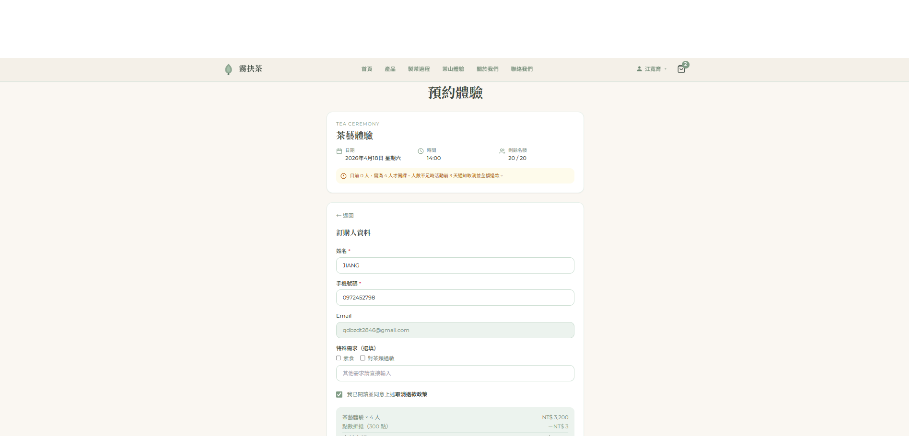</td>
    <td>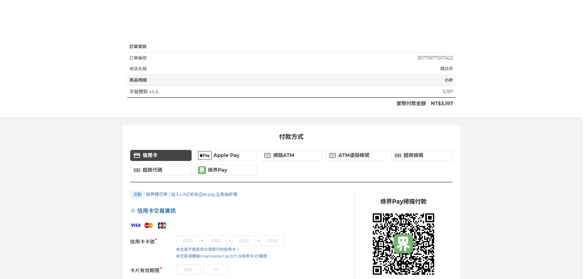</td>
  </tr>
</table>

### Storefront — Account
<table>
  <tr>
    <td align="center"><strong>Booking History</strong></td>
  </tr>
  <tr>
    <td align="center">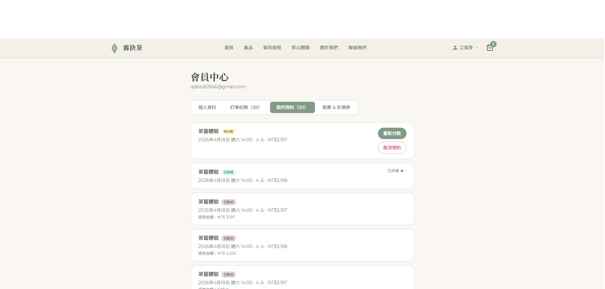</td>
  </tr>
</table>

### Admin Panel
<table>
  <tr>
    <td align="center"><strong>Login (2FA)</strong></td>
    <td align="center"><strong>Dashboard</strong></td>
  </tr>
  <tr>
    <td>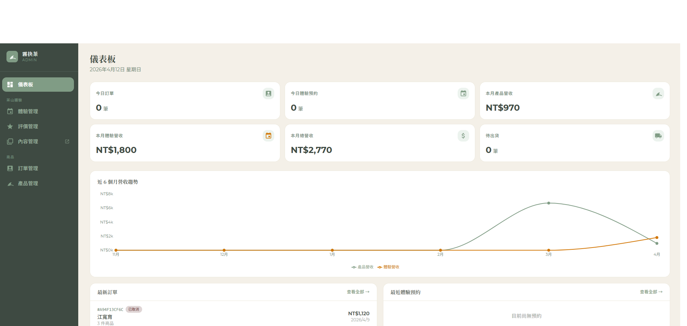</td>
    <td>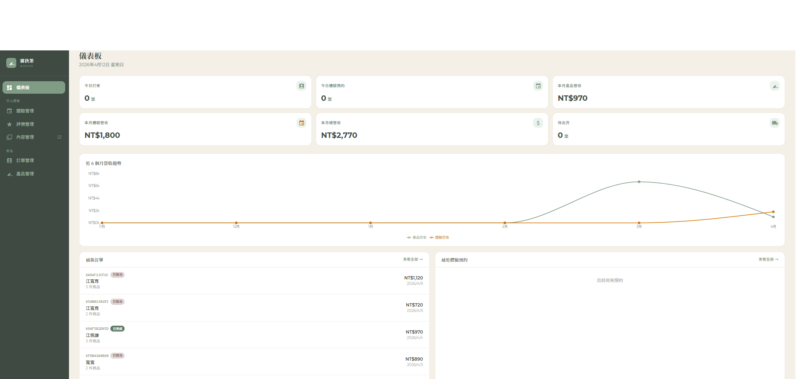</td>
  </tr>
  <tr>
    <td align="center"><strong>Session Management</strong></td>
    <td align="center"><strong>Booking Management</strong></td>
  </tr>
  <tr>
    <td>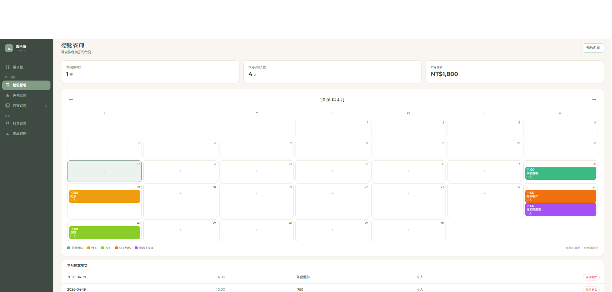</td>
    <td>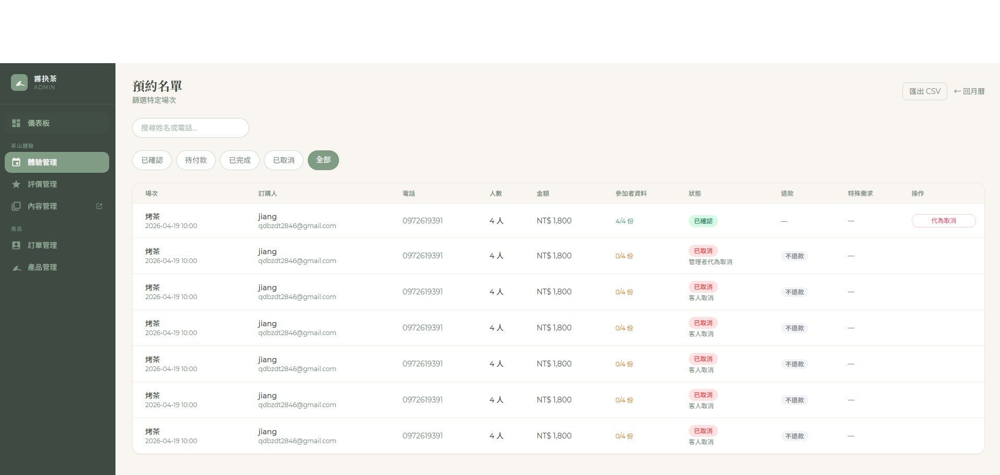</td>
  </tr>
</table>

---

## Overview

**Wu Jue Tea** is a full-stack platform built for a high-mountain tea farming family in Meishan, Chiayi, Taiwan. It combines two core systems:

1. **E-Commerce** — Product browsing, shopping cart, multi-gateway payments (ECPay / Stripe / PayPal), domestic & international shipping, order tracking
2. **Tea Experience Booking** — 5 experience types, session management, online booking & payment, waitlist system, post-experience reviews

---

## Tech Stack

| Category | Technology |
|---|---|
| **Framework** | [Next.js 16](https://nextjs.org/) (App Router) + [React 19](https://react.dev/) |
| **Language** | [TypeScript 5](https://www.typescriptlang.org/) (strict mode) |
| **Styling / Animation** | [Tailwind CSS 3](https://tailwindcss.com/) + [Shadcn UI](https://ui.shadcn.com/) + [Motion](https://motion.dev/) |
| **Database / Auth** | [Supabase](https://supabase.com/) (PostgreSQL + Auth + RLS) |
| **CMS** | [Sanity CMS](https://www.sanity.io/) (experience content + embedded Studio) |
| **i18n** | [next-intl](https://next-intl.dev/) (Traditional Chinese / English) |
| **Payments** | [ECPay](https://www.ecpay.com.tw/) (credit card / ATM / CVS code) + [Stripe](https://stripe.com/) (international credit card / Apple Pay / Google Pay) + [PayPal](https://www.paypal.com/) (international buyers) |
| **Logistics** | ECPay (CVS pickup) + international shipping rate calculator (zone-based / weight-based) |
| **AI Customer Service** | [Groq](https://groq.com/) (LLM-powered real-time chatbot) |
| **Email** | [Resend](https://resend.com/) (order / booking / waitlist notifications) |
| **Charts** | [Recharts](https://recharts.org/) (admin revenue charts) |
| **Testing** | [Vitest](https://vitest.dev/) (unit tests) |
| **SEO** | JSON-LD structured data, dynamic sitemap, robots.txt, OG Image |
| **Deployment** | [Vercel](https://vercel.com/) |

---

## Features

### Storefront — E-Commerce

- **Product Browsing**: Multiple specs (150g / 75g / tea bags), real-time stock display, auto-lock when sold out
- **Shopping Cart**: React Context state management, localStorage cache, Supabase cloud sync
- **Checkout**: Home delivery / CVS pickup (7-ELEVEN, FamilyMart, Hi-Life) / international shipping, free shipping on qualifying orders
- **Payment Methods**: ECPay (credit card / ATM / CVS code), Stripe (credit card / Apple Pay / Google Pay), PayPal (international buyers), cash on delivery
- **International Shipping**: Zone-based shipping rate calculation (ePacket max 2kg), worldwide delivery
- **Order Tracking**: View order history and status after login, supports cancellation
- **Coupons / Points**: Coupon code validation, auto-earn points after completing experiences, points redemption
- **AI Customer Service**: Floating chat widget, instant answers about products, shipping, returns, and more
- **Email Notifications**: Order confirmation, shipping notification (both customer & merchant copies)
- **Bilingual**: Full site supports Traditional Chinese / English toggle (next-intl)

### Storefront — Tea Experience Booking

- **Experience Browsing**: 5 experience types (Tea Ceremony, Roasted Tea Workshop, Tea Picking, Black Tea Making, Tea Fruit Wine Brewing)
- **Session Calendar**: Browse available sessions by month, real-time remaining capacity
- **Online Booking**: Fill in participant details (including emergency contact), confirmed upon ECPay payment
- **Waitlist System**: Join waitlist when sessions are full; auto-notify next in line (FIFO) when someone cancels, 24-hour confirmation window
- **Post-Experience Reviews**: Leave star ratings and comments after completing an experience
- **Account Center**: View all booking records, participant lists, cancellation requests

### Storefront — Authentication

- **Login / Register**: Email registration, Supabase Auth verification
- **Protected Routes**: Account center, order history, and booking management require authentication

### Admin Panel

- **Two-Factor Auth**: Admin password + 2FA (TOTP), max 5 failed login attempts per 15 minutes
- **Dashboard**: Today's order count, pending items, monthly revenue line chart
- **Order Management**: List filtering, view details, one-click status update, auto-send shipping notification
- **Product Management**: Edit prices, stock, publish/unpublish, image upload
- **Experience Management**: Session calendar, create / edit / cancel sessions, view booking list, update booking status, refund processing
- **Review Management**: Moderate reviews, toggle visibility
- **Settings**: Enable / disable 2FA

### Automation (Cron Jobs)

| Task | Schedule | Description |
|---|---|---|
| `complete-bookings` | Daily 02:00 UTC | Auto-mark completed experiences as "done", award loyalty points |
| `experience-reminders` | Daily 01:00 UTC | Participant info reminder (5 days before), day-before reminder, session confirmation/cancellation, waitlist expiry cleanup & cascade notification |

### SEO

- **JSON-LD Structured Data**: LocalBusiness schema (address, phone, postal code)
- **Dynamic Sitemap**: Auto-generated sitemap.xml including all experience pages
- **robots.txt**: Programmatically generated, excludes cart, checkout, and other non-public pages
- **OG Image**: Next.js dynamically generated Open Graph social sharing images
- **Google Search Console**: Integrated and verified

### Security

- **CSP Headers**: Dynamic nonce for XSS prevention, with `X-Frame-Options`, `HSTS`, `Permissions-Policy` and other HTTP security headers
- **ECPay Signature Verification**: `CheckMacValue` SHA256 verification + timing-safe comparison
- **PayPal Webhook Verification**: PayPal webhook signature validation
- **Supabase RLS**: Row-level security ensures customers can only access their own data
- **Admin Auth**: HMAC-signed cookie + 2FA (TOTP), all `/admin/*` routes protected by middleware
- **API Rate Limiting**: IP rate limiter (20 req/min), 5 failed login attempts per 15 min; AI chatbot 10 req/min
- **Server-Side Price Validation**: Backend recalculates order totals at checkout, never trusts client-side data

### Testing

- **Vitest Unit Tests**: International shipping rate calculation, PayPal payment integration (create order, capture, retry, cancellation, webhook, race conditions, rate limiting)

---

## Project Structure

```
├── messages/                             # i18n translation files
│   ├── zh.json                           # Traditional Chinese
│   └── en.json                           # English
│
src/
├── __tests__/                            # Unit tests
│   ├── international/                    # International shipping tests
│   └── paypal/                           # PayPal payment tests
│
├── app/                                  # Next.js 16 App Router
│   ├── layout.tsx                        # Root layout (GA, Auth, Cart Provider, ChatWidget)
│   ├── page.tsx                          # Home page
│   ├── sitemap.ts                        # Dynamic sitemap generation
│   ├── robots.ts                         # robots.txt generation
│   ├── opengraph-image.tsx               # Dynamic OG image generation
│   ├── about/                            # Brand story
│   ├── products/                         # Product listing
│   ├── process/                          # Tea making process
│   ├── experiences/                      # Tea experience listing
│   │   └── [slug]/                       # Experience detail + reviews
│   │       └── booking/[sessionId]/      # Booking flow
│   ├── cart/                             # Shopping cart
│   ├── checkout/                         # Checkout
│   ├── order/result/                     # Payment result
│   ├── waitlist/[id]/confirm/            # Waitlist confirmation page
│   ├── account/                          # Account center (protected)
│   │   └── bookings/[id]/participants/   # Booking participants
│   ├── auth/                             # Login / Register / OAuth callback
│   │   ├── login/                        # Login page
│   │   └── register/                     # Registration page
│   ├── contact/                          # Contact form
│   ├── faq/                              # FAQ
│   ├── privacy/                          # Privacy policy
│   ├── return-policy/                    # Return policy
│   ├── studio/                           # Sanity CMS Studio (embedded editor)
│   ├── admin/                            # Admin panel
│   │   ├── page.tsx                      # Admin login
│   │   ├── verify-2fa/                   # 2FA verification
│   │   └── (protected)/                  # Protected route group
│   │       ├── dashboard/                # Dashboard
│   │       ├── orders/[id]/              # Order management
│   │       ├── products/                 # Product management
│   │       ├── experiences/              # Experience / session / booking management
│   │       ├── reviews/                  # Review management
│   │       └── settings/                 # Settings (2FA)
│   └── api/
│       ├── orders/                       # Create, query, cancel orders
│       ├── bookings/                     # Create, query, cancel bookings, participants
│       ├── experiences/                  # Experience type listing
│       ├── experience-sessions/          # Session queries
│       ├── waitlist/                     # Join waitlist, confirm waitlist
│       ├── reviews/                      # Create reviews
│       ├── chat/                         # AI customer service chatbot (Groq LLM)
│       ├── user/coupons|points/          # Coupon validation, points query
│       ├── products/stock/               # Product stock
│       ├── shipping/countries/           # International shipping countries & rates
│       ├── ecpay/                        # ECPay payment + logistics (products + experiences + CVS map)
│       ├── stripe/                       # Stripe checkout + webhook (international payments)
│       ├── paypal/                       # PayPal payment (create order + capture + retry + webhook)
│       ├── cron/                         # Scheduled tasks
│       ├── admin/                        # Admin API (including 2FA, image upload)
│       ├── contact/                      # Contact form
│       ├── revalidate/                   # ISR cache revalidation
│       └── sanity-webhook/              # Sanity CMS Webhook
│
├── components/
│   ├── Header.tsx                        # Sticky navbar (responsive hamburger menu, cart icon)
│   ├── Footer.tsx
│   ├── ProductCard.tsx                   # Product card (multi-spec, stock status)
│   ├── TeaBagCard.tsx                    # Tea bag product card
│   ├── ProductLightbox.tsx               # Product image lightbox
│   ├── ChatWidget.tsx                    # AI customer service floating chat widget
│   ├── LanguageSwitcher.tsx              # Chinese / English language toggle
│   ├── SiteChrome.tsx                    # Auto-hide Header/Footer (admin routes)
│   ├── GoogleAnalytics.tsx               # GA4 integration
│   └── ui/                              # Shadcn UI components (button, select, etc.)
│
├── context/
│   ├── CartContext.tsx                   # Cart global state (localStorage + Supabase)
│   └── AuthContext.tsx                   # Supabase auth state
│
├── i18n/
│   ├── routing.ts                        # Locale routing config (zh default / en)
│   └── request.ts                        # Dynamic translation file loading
│
├── lib/
│   ├── supabase.ts / supabase-client.ts / supabase-server.ts
│   ├── experiences.ts                    # Experience data queries (Sanity + static fallback)
│   ├── products.ts                       # Product data queries
│   ├── email.ts                          # Resend emails (order / booking / waitlist / contact)
│   ├── waitlist.ts                       # Waitlist notification & expiry logic
│   ├── paypal.ts                         # PayPal API integration (token cache, create/capture orders)
│   ├── shipping.ts                       # Shipping rate calculation (domestic / international)
│   ├── shipping-constants.ts             # Shipping constants (spec weights, free shipping threshold, ePacket limit)
│   ├── chat-knowledge.ts                 # AI chatbot knowledge base (product + experience data cache)
│   ├── admin-auth-guard.ts               # Admin auth middleware
│   ├── admin-token.ts                    # HMAC signing
│   ├── rate-limit.ts                     # IP rate limiting
│   └── utils.ts
│
├── sanity/
│   ├── schemas/                          # Sanity CMS content models (experience, product, FAQ)
│   └── client.ts                         # Sanity Client config
│
├── data/
│   └── products.ts                       # Static product data (fallback)
│
├── types/
│   └── index.ts                          # Global TypeScript type definitions
│
└── proxy.ts                              # Middleware: i18n detection + CSP nonce + admin route protection
```

---

## Order Flow

```
Customer browses products
     │
     ▼
Add to cart (CartContext)
     │
     ▼
Fill checkout form (shipping info + payment + delivery method)
     │
     ├── Cash on Delivery ──► POST /api/orders ──► Write to DB (pending) + deduct stock + send email
     │
     ├── ECPay ──► POST /api/ecpay/checkout ──► Write to DB (pending)
     │                    │
     │                    ▼
     │            Auto-submit form to ECPay
     │                    │
     │       ┌────────────┴──────────────┐
     │       │                           │
     │  Server callback /api/ecpay/return   Browser callback /api/ecpay/result
     │  (verify sig → paid → deduct      (redirect to /order/result)
     │   stock → send email)
     │
     ├── Stripe ──► POST /api/stripe/checkout ──► Stripe Checkout Session
     │                    │
     │                    ▼
     │            Webhook /api/stripe/webhook ──► update to paid → deduct stock → send email
     │
     └── PayPal ──► POST /api/paypal/create-order ──► Create PayPal order
                          │
                          ▼
                  POST /api/paypal/capture ──► Capture payment → update to paid → send email
```

## Experience Booking Flow

```
Browse experiences /experiences
     │
     ▼
Select session (calendar) /experiences/[slug]
     │
     ├── Available ──► Fill booking details /experiences/[slug]/booking/[sessionId]
     │                    │
     │                    ▼
     │             ECPay payment ──► Booking confirmation email
     │
     └── Full ──► Join waitlist POST /api/waitlist
                       │
                       ▼ (when someone cancels)
              Waitlist notification email (24-hour confirmation deadline)
                       │
              ├── Confirm ──► GET /waitlist/[id]/confirm ──► Convert to confirmed booking
              └── Expired ──► Auto-expire, notify next in line
```

---

## Getting Started

### Prerequisites

- Node.js 18+
- Supabase project (free tier works)
- ECPay test merchant account
- Resend account with verified sending domain
- Sanity project (optional — falls back to static data)

### Installation

```bash
# 1. Clone the repository
git clone https://github.com/KuanYuJiangTW/my-tea-shop.git
cd my-tea-shop

# 2. Install dependencies
npm install

# 3. Set up environment variables
cp .env.example .env.local
# Edit .env.local with all required values below
```

### Environment Variables

```env
# ── Site URL ─────────────────────────────────
NEXT_PUBLIC_BASE_URL=https://your-domain.com

# ── Supabase ─────────────────────────────────
NEXT_PUBLIC_SUPABASE_URL=
NEXT_PUBLIC_SUPABASE_ANON_KEY=
SUPABASE_SERVICE_ROLE_KEY=

# ── Resend Email ─────────────────────────────
RESEND_API_KEY=
RESEND_FROM_EMAIL=Wu Jue Tea <noreply@your-domain.com>
ADMIN_EMAIL=

# ── ECPay Payment ────────────────────────────
ECPAY_MERCHANT_ID=
ECPAY_HASH_KEY=
ECPAY_HASH_IV=

# ── Stripe (optional, for international payments) ──
STRIPE_SECRET_KEY=
STRIPE_PUBLISHABLE_KEY=
STRIPE_WEBHOOK_SECRET=

# ── PayPal (optional, for international payments) ──
PAYPAL_CLIENT_ID=
PAYPAL_CLIENT_SECRET=
PAYPAL_WEBHOOK_ID=
PAYPAL_MODE=sandbox              # sandbox or live

# ── ECPay Logistics (CVS pickup) ─────────────
ECPAY_LOGISTICS_HASH_KEY=
ECPAY_LOGISTICS_HASH_IV=

# ── Admin Panel ──────────────────────────────
ADMIN_PASSWORD=
ADMIN_TOKEN_SECRET=        # Random string for HMAC signing

# ── AI Customer Service (optional) ───────────
GROQ_API_KEY=

# ── Sanity CMS (optional) ───────────────────
NEXT_PUBLIC_SANITY_PROJECT_ID=
NEXT_PUBLIC_SANITY_DATASET=production
SANITY_API_TOKEN=
SANITY_WEBHOOK_SECRET=     # Sanity Webhook verification

# ── Google Analytics (optional) ──────────────
NEXT_PUBLIC_GA_ID=G-XXXXXXXXXX

# ── LINE Official Account (optional, for AI chatbot handoff) ──
NEXT_PUBLIC_LINE_OFFICIAL_URL=

# ── Cron Secret (Vercel Cron verification) ───
CRON_SECRET=

# ── ISR Cache Revalidation ───────────────────
REVALIDATE_SECRET=
```

### Start Development Server

```bash
npm run dev
# Open http://localhost:3000
```

### Other Commands

```bash
npm run build      # Production build
npm run start      # Start production server
npm run lint       # ESLint check
npm run test       # Run unit tests (Vitest)
npm run test:watch # Watch mode tests
npx tsc --noEmit   # TypeScript type check
```

---

## Deploy to Vercel

```bash
npm i -g vercel
vercel --prod
```

After deploying, go to Vercel dashboard **Settings → Environment Variables** and fill in all environment variables.

**Cron Jobs** can be configured in `vercel.json` (or via the Vercel Dashboard Cron feature):

```json
{
  "crons": [
    {
      "path": "/api/cron/complete-bookings",
      "schedule": "0 2 * * *"
    },
    {
      "path": "/api/cron/experience-reminders",
      "schedule": "0 1 * * *"
    }
  ]
}
```

> **Note**: ECPay's `ReturnURL` and `OrderResultURL` must point to your production domain. For local testing, use [ngrok](https://ngrok.com/) to create a temporary public URL.

---

## License

[MIT](LICENSE) © 2026 Wu Jue Tea
