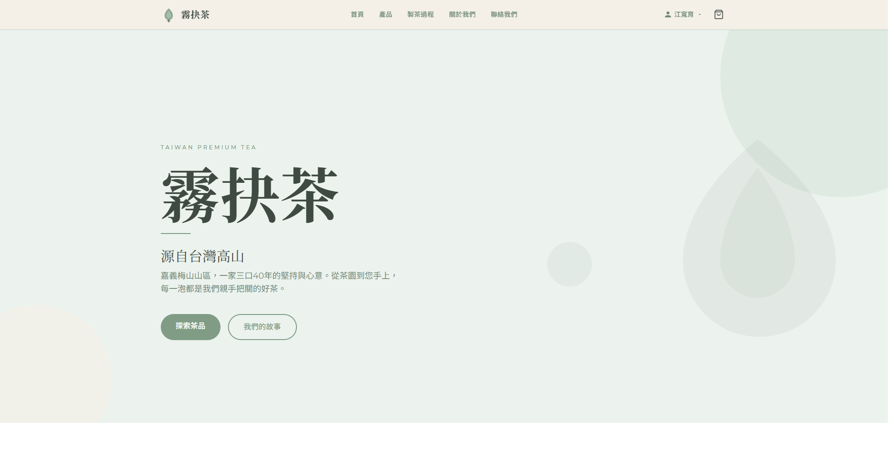
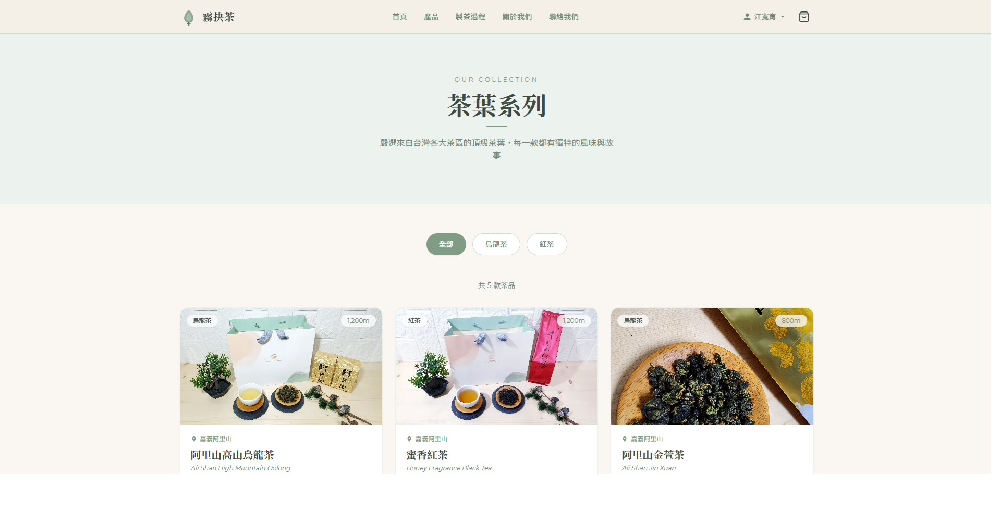
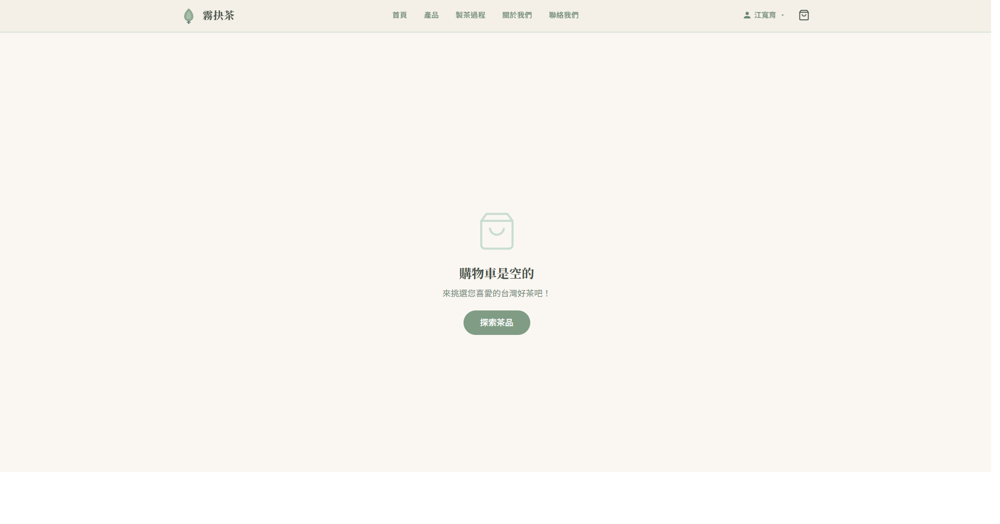
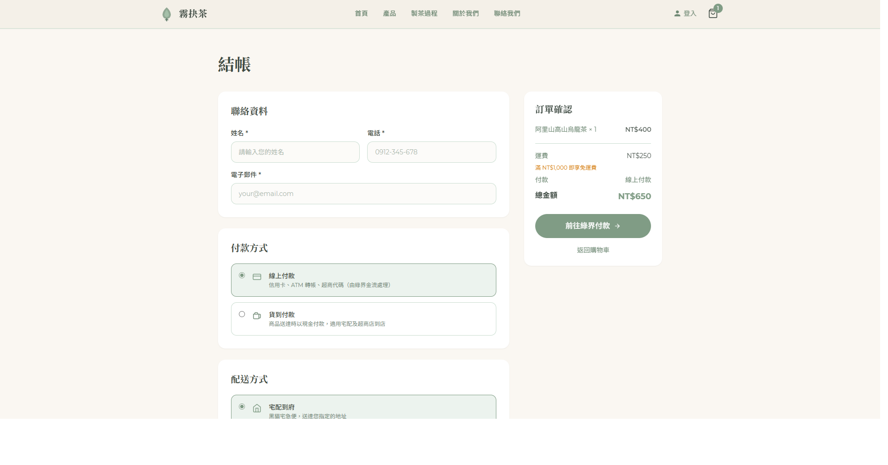
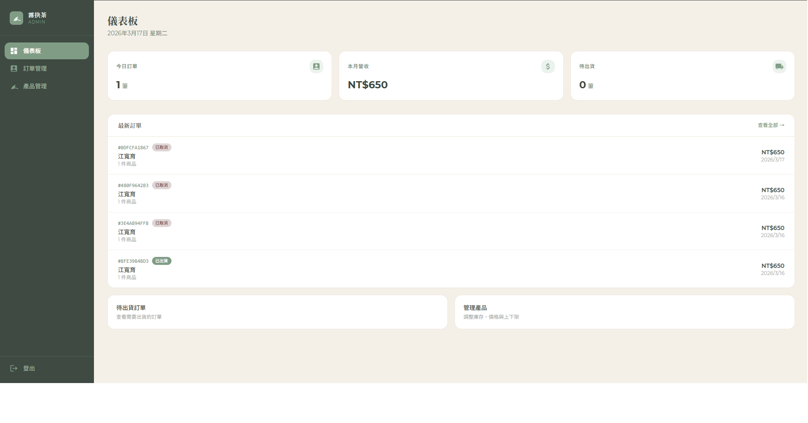

<div align="center">

# 霧抉茶 Wu Jue Tea

**台灣嘉義梅山高山茶｜自產自銷電商平台**

[](https://nextjs.org/)
[](https://www.typescriptlang.org/)
[](https://tailwindcss.com/)
[](https://supabase.com/)
[](LICENSE)

[線上預覽](https://taiwantea.store) · [管理後台](https://taiwantea.store/admin)

</div>

---

## 截圖

<table>
  <tr>
    <td align="center"><strong>首頁</strong></td>
    <td align="center"><strong>產品頁</strong></td>
  </tr>
  <tr>
    <td></td>
    <td></td>
  </tr>
  <tr>
    <td align="center"><strong>購物車</strong></td>
    <td align="center"><strong>結帳頁</strong></td>
  </tr>
  <tr>
    <td></td>
    <td></td>
  </tr>
  <tr>
    <td align="center" colspan="2"><strong>管理後台</strong></td>
  </tr>
  <tr>
    <td colspan="2" align="center"></td>
  </tr>
</table>

> 截圖存放於 `docs/screenshots/`，可自行替換。

---

## 專案簡介

**霧抉茶**是一個為台灣嘉義梅山山區茶農家庭打造的全端電商平台。
涵蓋從商品瀏覽、購物車管理、多元付款（綠界金流 / 貨到付款）、訂單追蹤，到完整的管理後台，支援庫存管理、訂單狀態更新與自動寄送 Email 通知。

---

## 技術棧

| 類別 | 技術 |
|---|---|
| **框架** | [Next.js 15](https://nextjs.org/)（App Router）+ [React 19](https://react.dev/) |
| **語言** | [TypeScript 5](https://www.typescriptlang.org/)（strict mode） |
| **樣式** | [Tailwind CSS 3](https://tailwindcss.com/) |
| **資料庫 / 認證** | [Supabase](https://supabase.com/)（PostgreSQL + Auth + RLS） |
| **金流** | [ECPay 綠界金流](https://www.ecpay.com.tw/)（信用卡 / ATM / 超商代碼） |
| **Email** | [Resend](https://resend.com/)（訂單確認信、出貨通知） |
| **分析** | Google Analytics 4 |
| **部署** | [Vercel](https://vercel.com/) |

---

## 功能列表

### 前台（顧客端）

- **商品瀏覽**：依類別篩選（烏龍茶 / 紅茶），即時庫存顯示，售完自動鎖定
- **購物車**：Context 狀態管理，支援增減數量、刪除品項，運費即時試算
- **結帳流程**：宅配到府 / 超商店到店，滿 NT$1,000 免運優惠
- **付款方式**：
  - 線上付款（ECPay 綠界，支援信用卡 / ATM / 超商代碼）
  - 貨到付款（宅配 / 超商）
- **會員系統**：Supabase Auth（Email 密碼 / OAuth），自動帶入收件資料
- **訂單追蹤**：登入後查看歷史訂單與最新狀態
- **Email 通知**：下單即發送確認信（顧客 + 商家雙份）

### 後台（管理端）

- **儀表板**：今日訂單數、待處理件數、月營收統計
- **訂單管理**：按狀態篩選、點進單筆查看完整明細、一鍵更新狀態（待付款 → 已付款 → 備貨中 → 已出貨 → 已完成）
- **出貨通知**：狀態改為「已出貨」時自動寄送出貨通知信給顧客
- **商品管理**：即時修改售價、庫存數量、上下架
- **安全驗證**：Cookie session 認證，所有 `/admin/*` 路由受 Middleware 保護

### 安全機制

- ECPay 回調 `CheckMacValue` SHA256 簽章驗證，防止偽造付款通知
- Supabase RLS 確保顧客只能查詢自己的訂單
- Admin 密碼以 Base64 編碼儲存於 Cookie，全站 API 路由均驗證 session

---

## 專案架構

```
src/
├── app/                          # Next.js 15 App Router
│   ├── layout.tsx                # 根版面（GA、Auth、Cart Provider）
│   ├── page.tsx                  # 首頁
│   ├── about/                    # 品牌故事頁
│   ├── products/                 # 商品列表頁
│   ├── process/                  # 製茶過程頁
│   ├── cart/                     # 購物車
│   ├── checkout/                 # 結帳頁
│   ├── order/result/             # 付款結果頁
│   ├── contact/                  # 聯絡表單
│   ├── privacy/                  # 隱私權政策
│   ├── return-policy/            # 退換貨政策
│   ├── auth/                     # 登入 / 註冊 / OAuth callback
│   ├── account/                  # 會員中心（受保護）
│   ├── admin/                    # 管理後台
│   │   ├── page.tsx              # 後台登入頁
│   │   └── (protected)/          # 受保護路由群組
│   │       ├── dashboard/        # 儀表板
│   │       ├── orders/           # 訂單管理
│   │       │   └── [id]/         # 訂單詳情
│   │       └── products/         # 商品管理
│   └── api/
│       ├── orders/               # POST 建立訂單（貨到付款）
│       ├── ecpay/
│       │   ├── checkout/         # POST 產生綠界付款表單
│       │   ├── return/           # POST 綠界 server 回調（含簽章驗證）
│       │   └── result/           # POST 綠界 browser 回調 → 轉址
│       └── admin/
│           ├── auth/             # POST 登入 / DELETE 登出
│           ├── orders/           # GET 訂單列表 / PATCH 更新狀態
│           └── products/         # GET 商品列表 / PATCH 更新欄位
│
├── components/
│   ├── Header.tsx                # 黏性頂部導覽（RWD 漢堡選單）
│   ├── Footer.tsx                # 頁腳
│   ├── ProductCard.tsx           # 商品卡片（hover 換圖、售完狀態）
│   ├── SiteChrome.tsx            # 自動隱藏 Header/Footer（後台路由）
│   └── GoogleAnalytics.tsx       # GA4 整合
│
├── context/
│   ├── CartContext.tsx            # 購物車全域狀態
│   └── AuthContext.tsx            # Supabase 認證狀態
│
├── lib/
│   ├── supabase.ts               # Server 端（Service Role Key）
│   ├── supabase-client.ts        # Browser 端（Anon Key）
│   ├── supabase-server.ts        # SSR 輔助
│   └── email.ts                  # Resend 信件（確認信 / 出貨通知）
│
├── data/
│   └── products.ts               # 靜態商品資料（seed 來源）
│
├── types/
│   └── index.ts                  # 全域 TypeScript 介面定義
│
└── middleware.ts                  # Supabase session 刷新 + Admin 路由保護
```

---

## 購物流程說明

```
顧客瀏覽商品
     │
     ▼
加入購物車（CartContext）
     │
     ▼
填寫結帳表單（收件資訊 + 付款方式 + 配送方式）
     │
     ├── 貨到付款 ──► POST /api/orders ──► 寫入 DB（pending）+ 扣庫存 + 寄信
     │                                          │
     │                                          ▼
     │                                     顯示訂單成立頁
     │
     └── 線上付款 ──► POST /api/ecpay/checkout ──► 寫入 DB（pending）
                              │
                              ▼
                      自動提交表單至綠界
                              │
                 ┌────────────┴─────────────┐
                 │                           │
    Server 回調 POST /api/ecpay/return    Browser 回調 POST /api/ecpay/result
    （驗證簽章 → 更新 paid → 扣庫存 → 寄信）  （轉址至 /order/result）
```

---

## 本地執行

### 前置需求

- Node.js 18+
- npm 9+
- Supabase 專案（免費方案即可）
- ECPay 測試商店帳號
- Resend 帳號並驗證寄信域名

### 安裝步驟

```bash
# 1. 複製專案
git clone https://github.com/your-username/my-tea-shop.git
cd my-tea-shop

# 2. 安裝依賴
npm install

# 3. 設定環境變數
cp .env.example .env.local
# 編輯 .env.local，填入下方所有必要欄位
```

### 環境變數

在 `.env.local` 填入以下欄位：

```env
# ── 綠界金流 ──────────────────────────────────────
ECPAY_MERCHANT_ID=       # 綠界商店代號
ECPAY_HASH_KEY=          # 綠界 HashKey
ECPAY_HASH_IV=           # 綠界 HashIV

# ── 網站網址（開發時用 ngrok 等工具對外曝露） ──────
NEXT_PUBLIC_BASE_URL=https://your-domain.com

# ── Resend Email ──────────────────────────────────
RESEND_API_KEY=          # Resend API Key
RESEND_FROM_EMAIL=霧抉茶 <noreply@your-domain.com>
ADMIN_EMAIL=             # 接收新訂單通知的信箱

# ── Supabase ──────────────────────────────────────
NEXT_PUBLIC_SUPABASE_URL=
NEXT_PUBLIC_SUPABASE_ANON_KEY=
SUPABASE_SERVICE_ROLE_KEY=

# ── Google Analytics（可選） ──────────────────────
NEXT_PUBLIC_GA_ID=G-XXXXXXXXXX

# ── 管理後台登入密碼 ───────────────────────────────
ADMIN_PASSWORD=
```

### Supabase 資料表

在 Supabase SQL Editor 執行以下 SQL 建立所需結構：

```sql
-- 訂單資料表
create table orders (
  id               uuid primary key default gen_random_uuid(),
  created_at       timestamptz default now(),
  customer_name    text not null,
  customer_email   text not null,
  customer_phone   text not null,
  payment_method   text not null,  -- 'online' | 'cod'
  payment_status   text not null default 'pending',
  shipping_address jsonb not null,
  items            jsonb not null,
  shipping_fee     integer not null,
  total_amount     integer not null,
  ecpay_trade_no   text,
  note             text,
  user_id          uuid references auth.users(id)
);

-- 商品資料表
create table products (
  id             integer primary key,
  stock_quantity integer not null default 0
);

-- 庫存扣減函式
create or replace function decrement_stock(p_id integer, qty integer)
returns void language sql as $$
  update products
  set stock_quantity = greatest(stock_quantity - qty, 0)
  where id = p_id;
$$;
```

### 啟動開發伺服器

```bash
npm run dev
# 開啟 http://localhost:3000
```

### 其他指令

```bash
npm run build    # 正式環境建置
npm run start    # 啟動正式伺服器
npm run lint     # ESLint 檢查
npx tsc --noEmit # TypeScript 型別檢查
```

---

## 部署至 Vercel

```bash
# 安裝 Vercel CLI
npm i -g vercel

# 部署
vercel --prod
```

部署後請至 Vercel 後台 **Settings → Environment Variables** 填入所有 `.env.local` 中的鍵值。

> **注意**：ECPay 的 `ReturnURL` 與 `OrderResultURL` 需指向正式網域，綠界不接受 `localhost`。本地測試可使用 [ngrok](https://ngrok.com/) 或 [localtunnel](https://github.com/localtunnel/localtunnel) 建立臨時公開網址。

---

## 授權

[MIT](LICENSE) © 2025 霧抉茶 Wu Jue Tea
